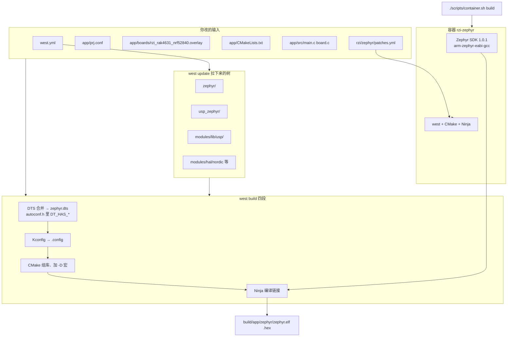
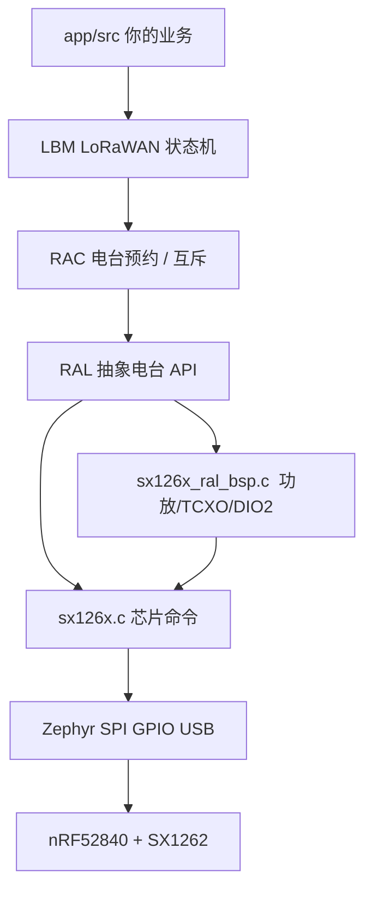
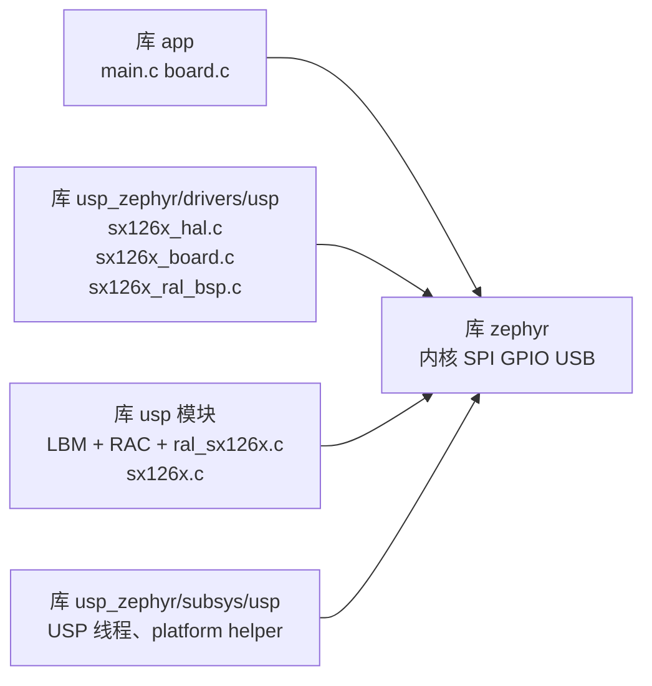

# 本工程怎么编起来：文件与框架（从上到下）

日常一条命令：

```bash
./scripts/container.sh build
```

内部是：打 `west patch` → 容器里 `west build --sysbuild -b rzi_rak4631/nrf52840` → 产出 `build/app/merged.hex`。

运行时分层见 `rzi/doc/architecture-zh.md`，backend 切换见 `rzi/doc/lorawan-backends.md`。本文只讲 **构建**：哪些文件进编译器、用的什么框架。

打开本文件请用 Markdown 预览（`Ctrl+Shift+V`），才能看到图。

---

## 1. 一张图：从命令到固件



容器把整仓挂到 `/workdir`，`ZEPHYR_BASE=/workdir/zephyr`。本机路径和容器路径不要写进同一份 `CMakeCache`。

---

## 2. 工作区里各目录是什么

T2 拓扑：清单仓是 `app/`，见 [west 拓扑](./west-topology.md)。

```text
rzi/                          west 工作区根
├── app/                      清单仓 = 你的应用（git 主仓）
│   ├── west.yml              拉哪些依赖、钉哪次提交
│   ├── CMakeLists.txt        声明源文件、链 lbm_compile_definitions
│   ├── prj.conf              应用 Kconfig
│   ├── src/main.c            入网、上报、LED
│   ├── src/board.c           全擦后 UICR REGOUT0 → 3.3 V
│   ├── boards/*.overlay      电台 binding、密钥、USB console
│   └── scripts/container.sh  自动应用 RZI 补丁并构建
├── rzi/                      RZI 模块及其 west patch 元数据
├── zephyr/                   RTOS + 构建系统（钉 SHA，4.4.99）
├── usp_zephyr/               Semtech 的 Zephyr 胶水模块
├── modules/lib/usp/          LBM + RAC + sx126x 驱动源码
├── modules/hal/nordic/       nRF52840 HAL（zephyr/west.yml import 进来）
├── docker/Dockerfile
└── scripts/container.sh
```

| 路径 | 框架 / 角色 | 编的时候干什么 |
|------|-------------|----------------|
| `app/` | 你的固件应用 | 业务 C、overlay、prj.conf |
| `zephyr/` | Zephyr RTOS | 内核、GPIO/SPI/USB、CMake 模块、板级 `rak4631` |
| `usp_zephyr/` | Zephyr extra module | Kconfig、SX1262 驱动 BSP、HAL 胶水、线程 |
| `modules/lib/usp/` | 平台无关 C 库 | LoRaWAN（LBM）、电台排队（RAC）、芯片驱动 `sx126x.c` |
| `modules/hal/nordic/` | Nordic nrfx | nRF52840 寄存器级支持 |
| Docker 镜像 | 工具链 | west、CMake、Ninja、SDK 编译器 |

`usp_zephyr` 和 `usp` 是两个 git。胶水在前者，协议栈源码在后者。CMake 把两边的 `.c` 编进同一份 elf。

---

## 3. 运行时框架（编进去的软件栈）

不是又一套构建系统，是**链进固件的层**：



| 层 | 源码大致在 | 你怎么打开它 |
|----|------------|--------------|
| 应用 | `app/src/` | 直接写 |
| LBM | `modules/lib/usp/protocols/lbm_lib/` | `CONFIG_USP_LORA_BASICS_MODEM=y` |
| RAC / RAL | `modules/lib/usp/smtc_rac_lib/` | `CONFIG_USP=y`（会 `select` RAL） |
| Radio HAL + BSP | `usp_zephyr/drivers/usp/sx126x/` | `CONFIG_LORA_BASICS_MODEM_DRIVERS=y` + DTS `semtech,sx1262-new` |
| MCU HAL | `usp_zephyr/modules/smtc_modem_hal/` | 随 USP 编进来 |
| Zephyr 驱动 | `zephyr/drivers/` | `CONFIG_SPI` / `GPIO` / `USB`… |
| 板级 | `zephyr/boards/rakwireless/rak4631/` + overlay | `-b rak4631/nrf52840` |

不要开 `CONFIG_LORA` / `CONFIG_LORAWAN`：那是树上另一套 LoRaWAN，会和 USP 抢同一颗 SX1262。

---

## 4. `west build` 实际读哪些文件

板名 `rak4631/nrf52840`，应用源目录 `app/`。

### 4.1 设备树（先合并，再生成头文件）

从底向上叠：

```text
zephyr/dts/arm/...nrf52840...
  → zephyr/boards/rakwireless/rak4631/rak4631_nrf52840.dts     板上 SPI、SX1262 脚、led0
    → app/boards/rzi_rak4631_nrf52840.overlay                     密钥与 USB console；射频在 rzi_rak4631 板上
```

USP 的 binding 在 `usp_zephyr/dts/bindings/usp/semtech,sx1262-new.yaml`（`usp_zephyr` 的 `module.yml` 声明了 `dts_root`）。

合并结果：`build/app/zephyr/zephyr.dts`。
有这颗节点就会生成：

```text
CONFIG_DT_HAS_SEMTECH_SX1262_NEW_ENABLED=y
```

写在 `build/app/zephyr/include/generated/zephyr/autoconf.h`。

### 4.2 Kconfig（功能开关）

```text
zephyr/Kconfig
  + usp_zephyr/Kconfig          → drivers/Kconfig、subsys/Kconfig
  + app/prj.conf                你打开的 CONFIG_*
```

本应用关键项：

| `prj.conf` | 作用 |
|------------|------|
| `CONFIG_LORA=n` `CONFIG_LORAWAN=n` | 关掉树上 LoRa |
| `CONFIG_LORA_BASICS_MODEM_DRIVERS=y` | 编 USP 电台驱动 |
| `CONFIG_USP=y` | 编 RAC 线程 / 平台胶水 |
| `CONFIG_USP_LORA_BASICS_MODEM=y` | 把 LBM `.c` 加进工程 |
| `CONFIG_GPIO` / `SPI` / `FLASH` / USB CDC | Zephyr 外设 |

最终：`build/app/zephyr/.config`。

### 4.3 CMake（组库、加宏）

入口：`app/CMakeLists.txt`

```cmake
find_package(Zephyr REQUIRED HINTS $ENV{ZEPHYR_BASE})
project(rzi_app)
target_sources(app PRIVATE src/main.c src/board.c)
target_link_libraries(app PRIVATE lbm_compile_definitions)
```

Zephyr 再按 `zephyr/module.yml` 拉模块：

| 模块 | 登记文件 | CMake 入口 |
|------|----------|------------|
| `usp_zephyr` | `usp_zephyr/zephyr/module.yml` | `usp_zephyr/CMakeLists.txt` → `drivers/` + `subsys/` |
| `usp` | `modules/lib/usp/zephyr/module.yml`（`cmake-ext: true`） | 实际 CMake 在 `usp_zephyr/modules/usp/` |

于是编出几份 **独立的 `zephyr_library()`**（不是一个大文件夹乱编）：



`sx126x.cmake` 里芯片型号宏必须是**全局** `zephyr_compile_definitions_ifdef`，否则只进「usp 模块」那份库，**到不了** `sx126x_ral_bsp.c`。这就是补丁 `0004-sx1262-pa-compile-definitions`。

```text
DTS semtech,sx1262-new
  → CONFIG_DT_HAS_SEMTECH_SX1262_NEW_ENABLED
    → -DSX1262（全局）
      → #if defined(SX1262) 配高压功放
```

`lbm_compile_definitions` 是另一套宏：把 `CONFIG_LORA_BASICS_MODEM_CLASS_C` 变成 LBM 源码里的 `ADD_CLASS_C`。应用要读这些宏才需要 `target_link_libraries(app PRIVATE lbm_compile_definitions)`。和 `SX1262` 不是一回事。

### 4.4 编译链接

Ninja 用 SDK 的 `arm-zephyr-eabi-gcc`，目标 Cortex-M4（nRF52840）。

产物：

| 文件 | 用途 |
|------|------|
| `build/app/zephyr/zephyr.elf` | 调试、反汇编 |
| `build/app/zephyr/zephyr.hex` | `./scripts/flash-rak4631.sh` 烧录 |
| `build/app/compile_commands.json` | clangd（脚本会改成本机路径） |

---

## 5. 补丁插在哪

`usp_zephyr` 是 west 拉下来的，不能在里面直接 commit。RZI backend 所需修正
由 RZI 模块统一维护：

```text
rzi/zephyr/patches.yml
rzi/zephyr/patches/usp_zephyr/0001-...
                                  0002-...
                                  0003-...
                                  0004-sx1262-pa-compile-definitions.patch
```

`./scripts/container.sh build` 会先执行 `west patch -sm rzi clean` 和
`west patch -sm rzi apply --roll-back`，再配置 CMake。约定见
[west patch](./west-patch.md)。

---

## 6. 你改代码时对号入座

| 要改的事 | 动哪个文件 | 不要动 |
|----------|------------|--------|
| 入网、LED、上报周期 | `app/src/main.c` | LBM 源码 |
| 全擦后 3.3 V | `src/boards/rak4631.c` | 板级 dts 仓 |
| 密钥、区域、SX1262 属性 | `app/boards/rak4631_nrf52840.overlay` | `usp_zephyr/boards/` |
| 开 USB / USP / 关树上 LoRa | `app/prj.conf` | — |
| 依赖版本 | `west.yml` | 容器里 `west init` |
| RZI backend 的上游缺陷 | `rzi/zephyr/patches/` | 直接改 `usp_zephyr/` |

USP backend 的 Kconfig / overlay 见 `rzi/doc/lorawan-backends.md`。
